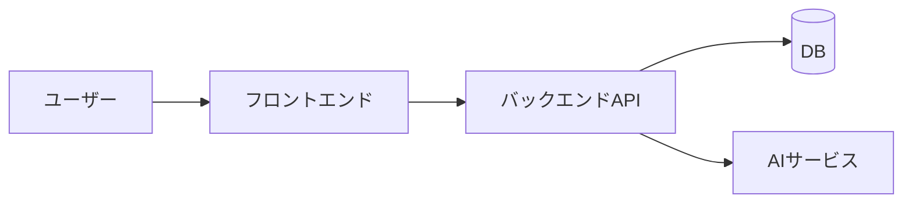

# PoC 準備

---

## 【必須】1. PoC スコープ
- **目的（何を検証するか）**：
- **検証仮説（○○なら△△できる）**：
- **成功条件（最大3つまで）**：
- **期間 / 体制 / 想定デモシナリオ**：

---

## 【必須】2. 実装対象の画面・機能一覧
| 優先度 | 画面 ID | 画面名 | 機能 ID | 機能名 | IN / OUT | 備考 |
|---|---|---|---|---|---|---|
| P1 | SCR-01 |  | FEAT-01 |  | IN |  |

> P1 = 必須（デモ成立に不可欠） / P2 = 望ましい / P3 = 余裕あれば

---

## 【必須】3. 使用技術とその選定理由
### フロントエンド
- **選定**：
- **理由**：
- **代替案**：
- **リスク/対策**：

### バックエンド / API
- **選定**：
- **理由**：
- **代替案**：
- **リスク/対策**：

### データ / ストレージ
- **選定**：
- **理由**：
- **代替案**：
- **リスク/対策**：

### AI / 外部サービス
- **選定**：
- **理由**：
- **代替案**：
- **リスク/対策**：

---

## 【必須】4. 想定構成図（Mermaid 等）

- **主要ライブラリ（簡単で OK）**：
  - 例：React Hook Form（フォーム制御）
  - 例：TanStack Query（データフェッチ/キャッシュ）

---

## 【任意】5. 最小データ定義
- **主要エンティティ**：
  - User（id, name, email, role）
  - Item（id, title, price, description）
- **API エンドポイント例**：
  - `GET /api/items`
  - `POST /api/items`

---

## 【任意】6. ライブラリ計画
| レイヤ | ライブラリ | 目的/採用理由 | 代替案 |
|---|---|---|---|
| FE | React Hook Form | フォーム制御 | Formik |
| FE | TanStack Query | データフェッチ/キャッシュ | SWR |
| BE | FastAPI | 迅速な API 実装 | Express |
| BE | SQLAlchemy | ORM | Prisma |
| AI | LangChain | プロンプト/ワークフロー | 自前実装 |

---

## 【任意】7. リスク・前提・やらないこと
- **リスク**：
  - API レート制限
  - モデル精度不足
- **前提**：
  - ダミーデータ可
  - 認証は簡易
- **OUT スコープ**：
  - 決済
  - 通知機能

---

## 【任意】8. デモストーリー（1分）
1. トップ画面で○○を入力
2. 「生成」ボタンを押す
3. 結果が表示される
4. 必要に応じて保存や共有ができる
